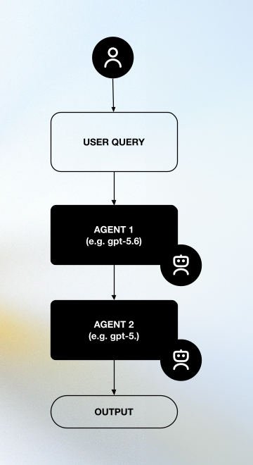
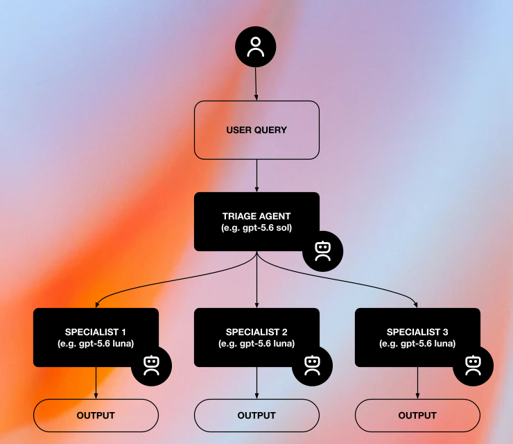
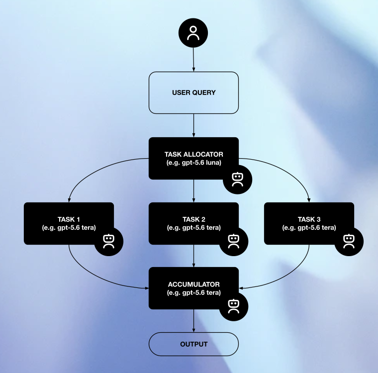
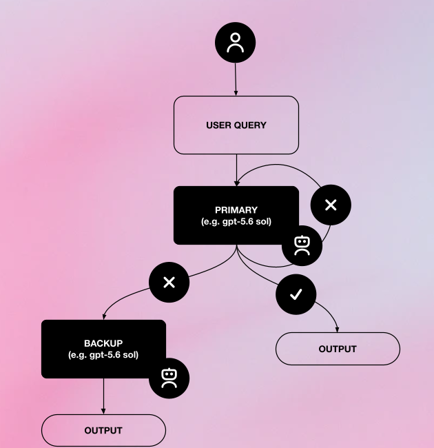
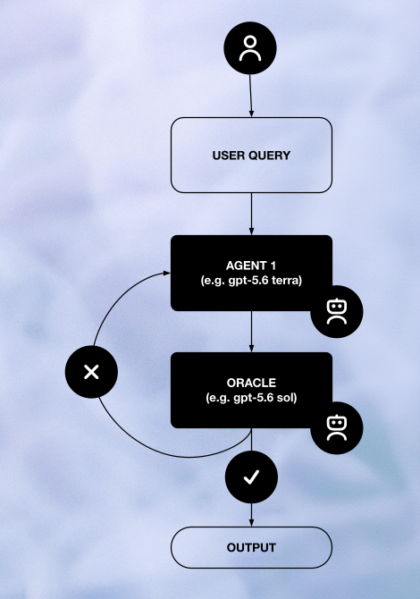
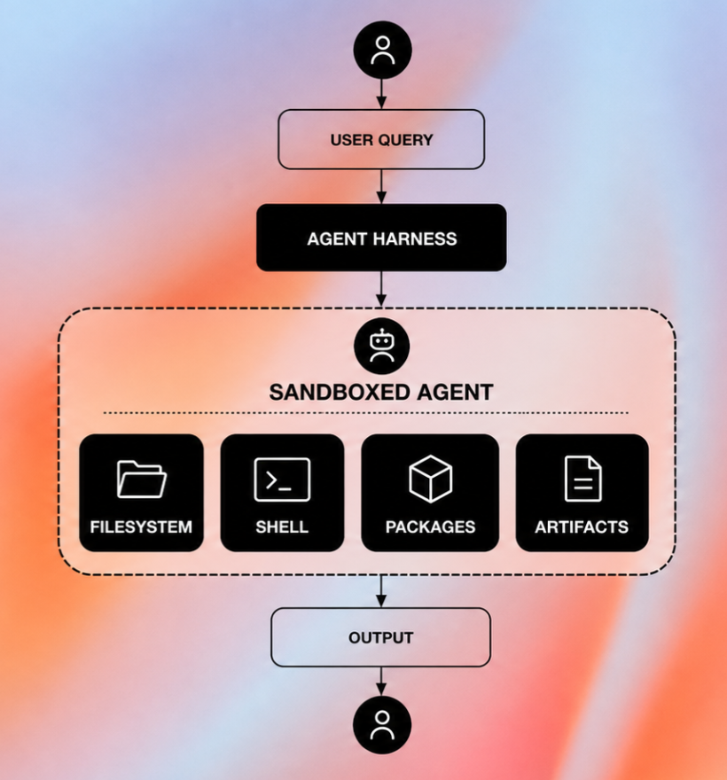

# Agent Pattern Examples

## 프로젝트 소개

OpenAI Agents SDK로 자주 쓰이는 에이전트 아키텍처 패턴을 구현하고 실습하는 튜토리얼 저장소입니다.

각 패턴은 구조를 보여주는 다이어그램, 실행 가능한 Python 예제, 단계별 Jupyter Notebook으로 구성됩니다. 현재 계획 수립, hand-off, 병렬 실행, 재시도, 평가와 개선, 샌드박스 작업의 6개 패턴을 다룹니다.

## 패턴 목록

| 패턴 | 이미지 | 구현 예제 | 핵심 흐름 | 코드 |
|---|---|---|---|---|
| [Workflow planning](patterns/workflow_planning/) |  | 리서치 보고서 작성 | 검색 계획 수립 → 병렬 검색 → 보고서 작성 | [manager.py](patterns/workflow_planning/examples/research_report/src/manager.py) |
| [Triage hand-off](patterns/triage_handoff/) |  | 언어별 전문 에이전트 연결 | 입력 언어 판단 → 전문 에이전트에 제어권 위임 | [main.py](patterns/triage_handoff/examples/language_routing/src/main.py) |
| [Parallel execution](patterns/parallel_execution/) |  | 번역 후보 생성 및 선택 | 번역 후보 3개 동시 생성 → 최적 후보 선택 | [main.py](patterns/parallel_execution/examples/translation_candidates/src/main.py) |
| [Retry or fallback](patterns/retry_or_fallback/) |  | 일시적 오류 재시도 | 오류 판단 → 백오프 → 재시도. 백업 모델 전환은 미포함 | [main.py](patterns/retry_or_fallback/examples/transient_error_retry/src/main.py) |
| [Evaluator-optimiser](patterns/evaluator_optimiser/) |  | 이야기 개요 평가 및 개선 | 초안 생성 → 평가 → 피드백 반영 → 반복 | [main.py](patterns/evaluator_optimiser/examples/story_refinement/src/main.py) |
| [Sandboxed agent](patterns/sandboxed_agent/) |  | 격리된 작업 공간의 파일 조사 | 작업 파일 준비 → 샌드박스 생성 → shell로 조사 → 응답 | [main.py](patterns/sandboxed_agent/examples/workspace_inspection/src/main.py) |

## 디렉터리 구조

```text
agent-pattern-examples/
├── README.md
├── THIRD_PARTY_NOTICES.md
├── UPSTREAM.json
├── requirements.txt
├── requirements-notebooks.txt
├── docs/
│   ├── setup.md
│   ├── notebook-validation.md
│   ├── contributing.md
│   ├── code-organization.md
│   └── assets
│       └── agent-patterns
├── scripts/       # Notebook 검증 등 개발 도구
├── tests/         # 검증 도구 및 Colab·Sandbox 지원 테스트
└── patterns/
    ├── workflow_planning/examples/research_report/
    ├── triage_handoff/examples/language_routing/
    ├── parallel_execution/examples/translation_candidates/
    ├── retry_or_fallback/examples/transient_error_retry/
    ├── evaluator_optimiser/examples/story_refinement/
    └── sandboxed_agent/examples/workspace_inspection/
```

각 패턴에는 예제 목록을 담은 `README.md`가 있습니다. 각 예제는 아래 구조를 따릅니다.

```text
<example>/
├── README.md
├── src/
│   ├── __init__.py
│   └── main.py      # 실행 진입점; 복잡한 예제는 역할별 파일 추가
└── notebooks/
    ├── README.md
    └── <pattern>-ko.ipynb
```

예제 코드는 `src/`에 두고, `data/`와 `outputs/`는 필요한 예제에만 추가합니다. 새 예제·Notebook의 작성 규칙은 [기여 가이드](docs/contributing.md)에 있습니다. 디렉터리 구조, `main.py` 명명 및 코드 분리 기준은 [코드 구성 기준](docs/code-organization.md)을 참고하세요.

패턴 README에서 예제를 선택하고, 예제 README에서 상세 설명과 실행 명령을 확인하세요.

## Notebook

각 예제의 `notebooks/<pattern>-ko.ipynb`에서 실행할 수 있습니다. 앞부분 실습은 기본적으로 API 호출을 생략하며, 실행할 때 설정 셀의 `RUN_API=True`로 변경합니다. 후반 독립 실행 예제는 호출 셀의 별도 인수 `run_api=True`로 활성화합니다. `RUN_API`만 변경하면 이 인수는 바뀌지 않습니다. [uv 환경 설정](docs/setup.md) · [Notebook 검증 결과](docs/notebook-validation.md)

6개 Notebook 모두 로컬 Jupyter와 Colab에서 실행하도록 구성되어 있습니다. Colab은 패턴 README의 **Colab에서 열기** 링크 또는 예제 README·Notebook 상단의 **Open in Colab** 배지로 시작합니다. 첫 설정 셀이 Colab에서만 필요한 패키지를 설치하므로 저장소 checkout이나 Drive 연결은 필요하지 않습니다. 개발 브랜치 링크는 해당 변경 사항을 GitHub에 푸시한 뒤 사용할 수 있습니다.

기본 오프라인 실행에는 API 키나 `.env.local`이 필요하지 않습니다. Colab에서 실제 API를 호출하려면 Secrets에 `OPENAI_API_KEY`를 등록하고 Notebook 접근을 허용하세요. 기존 환경 변수에 키가 있으면 우선 사용하며, 로컬 `.env.local`은 Colab에 자동 전달되지 않습니다. 자세한 절차는 [Colab 실행 안내](docs/setup.md#colab-실행)를 참고하세요.

## 공통 설치

아래 명령은 로컬 CLI용 공통 의존성을 설치합니다. 로컬 Notebook에는 `requirements-notebooks.txt`를 사용하세요. Jupyter 설정과 Docker·Modal 준비를 포함한 안내는 [환경 설정](docs/setup.md)을 참고하세요.

Python 3.10 이상과 pip가 필요합니다. 저장소 루트에서:

```bash
python -m venv .venv
source .venv/bin/activate
python -m pip install -r requirements.txt
```

실제 API를 호출할 때는 `OPENAI_API_KEY`가 필요하며 비용이 발생할 수 있습니다. CLI 소스는 환경 파일을 자동으로 읽지 않으므로 환경 변수를 미리 설정해야 합니다. 로컬 Notebook은 `find_dotenv()`로 현재 작업 디렉터리 또는 상위 디렉터리의 선택적 `.env.local`을 찾으며, 기존 환경 변수의 값을 우선합니다. API 키를 소스에 넣거나 커밋하지 마세요.

각 폴더의 README에 실행 명령이 있습니다. 개별 예제 폴더로 이동한 뒤 `python -m src.main`으로 실행합니다. Agents SDK는 GitHub checkout 대신 PyPI의 `openai-agents[docker]==0.22.1` 패키지를 사용합니다.

## 예제 범위

- Workflow planning: 계획 → 검색 → 보고서 작성. 범용 의존성 관리 엔진은 아닙니다.
- Parallel execution: 동일 작업의 후보를 병렬 생성하고 선택합니다. 다른 검색 작업을 병렬 처리하는 흐름은 workflow_planning에도 있습니다.
- Retry or fallback: 공식 retry 예제를 포함합니다. 백업 모델 전환 코드는 포함하지 않습니다.
- Evaluator-optimiser: 평가 피드백을 반영해 반복합니다. 평가 모델의 성능 우위나 최종 품질을 보장하지 않습니다.
- Sandboxed agent: Notebook의 기본 백엔드는 로컬 Docker·Colab Modal이며, `SANDBOX_BACKEND`로 변경할 수 있습니다. 실제 Modal 실행에는 계정과 인증이 필요하고 모델 API와 별도 사용료가 발생할 수 있습니다. Colab에서는 `MODAL_TOKEN_ID`·`MODAL_TOKEN_SECRET`을 Secrets에 등록할 수 있습니다. 설치·인증은 [Sandbox 설정](docs/setup.md#sandbox-예제)을 참고하세요. 상태 보존·재개는 이 기본 예제의 범위 밖입니다.
- CLI 소스는 원본의 모델명과 기본값을 유지했습니다. Notebook은 학습용으로 모델·반복 횟수·검색 규모 등을 조정했으며, 각 예제 README의 “Notebook과 CLI의 차이”에 설명했습니다. 사용 환경에서 접근 가능한 모델인지 실행 전에 확인하세요.

## 소스 코드 출처

- 원본: [https://github.com/openai/openai-agents-python](https://github.com/openai/openai-agents-python)
- 고정 커밋: [`25af629b3c877ba3d0e95189141bb636b21167a5`](https://github.com/openai/openai-agents-python/tree/25af629b3c877ba3d0e95189141bb636b21167a5)
- SDK 설치 패키지: [PyPI `openai-agents` 0.22.1](https://pypi.org/project/openai-agents/0.22.1/)
- 각 예제의 `src/`는 공식 예제를 재구성한 코드입니다. 4개 실행 파일의 입력 처리를 단순화했고, 파일 경로·실행 파일명을 통일하면서 필요한 import와 실행 안내를 수정했습니다. 수정 여부와 원본 해시는 파일별 출처 기록에 있습니다.
- 각 파일의 원본 경로와 SHA-256(수정 파일은 원본·로컬 해시 및 변경 내역): [UPSTREAM.json](UPSTREAM.json)
- 원본 MIT 라이선스와 저작권 고지: [THIRD_PARTY_NOTICES.md](THIRD_PARTY_NOTICES.md)
- 각 패턴·예제·Notebook 폴더의 안내 문서, docs/, 루트 README 및 설정 파일은 모음을 위해 추가했습니다.

### 패턴별 원본 코드

아래 링크는 복사 시점의 고정 커밋을 가리킵니다.

| 패턴 | 원본 파일 |
|---|---|
| Workflow planning | [openai-agents-python/examples/research_bot/manager.py](https://github.com/openai/openai-agents-python/blob/25af629b3c877ba3d0e95189141bb636b21167a5/examples/research_bot/manager.py) |
| Triage hand-off | [openai-agents-python/examples/agent_patterns/routing.py](https://github.com/openai/openai-agents-python/blob/25af629b3c877ba3d0e95189141bb636b21167a5/examples/agent_patterns/routing.py) |
| Parallel execution | [openai-agents-python/examples/agent_patterns/parallelization.py](https://github.com/openai/openai-agents-python/blob/25af629b3c877ba3d0e95189141bb636b21167a5/examples/agent_patterns/parallelization.py) |
| Retry or fallback | [openai-agents-python/examples/basic/retry.py](https://github.com/openai/openai-agents-python/blob/25af629b3c877ba3d0e95189141bb636b21167a5/examples/basic/retry.py) |
| Evaluator-optimiser | [openai-agents-python/examples/agent_patterns/llm_as_a_judge.py](https://github.com/openai/openai-agents-python/blob/25af629b3c877ba3d0e95189141bb636b21167a5/examples/agent_patterns/llm_as_a_judge.py) |
| Sandboxed agent | [openai-agents-python/examples/sandbox/basic.py](https://github.com/openai/openai-agents-python/blob/25af629b3c877ba3d0e95189141bb636b21167a5/examples/sandbox/basic.py) |

## 라이선스

복사한 공식 예제는 MIT 라이선스로 제공됩니다. 원본의 저작권 고지와 라이선스 전문을 [THIRD_PARTY_NOTICES.md](THIRD_PARTY_NOTICES.md)에 보존했습니다. 소스를 재배포할 때 해당 고지와 라이선스 조건을 함께 유지하세요.

## 검증

수정하지 않은 파일의 원본 해시 일치, 수정 파일의 로컬 해시, Python 구문, 로컬 예제 import 경로를 정적으로 확인했습니다. CLI 소스의 실제 실행은 별도 검증하지 않았습니다. Notebook 설치·실행 검증은 [검증 결과](docs/notebook-validation.md)를 참고하세요.

Notebook 환경을 설치한 뒤 저장소 루트에서 `python scripts/check_notebooks.py`로 전체 오프라인 검증을 실행합니다. `--example language_routing`으로 예제를 선택할 수 있으며, `--live`는 앞부분 실습의 실제 API 호출을 활성화합니다. 전체 실제 실행에는 선택한 Sandbox 백엔드도 필요합니다. 결과는 `.cache/notebook-validation.json`에 저장됩니다.

검증 도구의 통합 테스트와 Colab·Sandbox 지원 테스트는 `python -m unittest discover -s tests -v`로 실행합니다. Modal 어댑터 테스트는 선택적 Modal 의존성이 없으면 건너뜁니다. 설치 방법과 검증 범위는 [검증 기록](docs/notebook-validation.md#다시-실행)에 있습니다. 로컬 실행과 Colab 모의 테스트는 통과했으며, 실제 Colab 런타임 및 Modal 원격 실행은 아직 확인하지 않았습니다.
